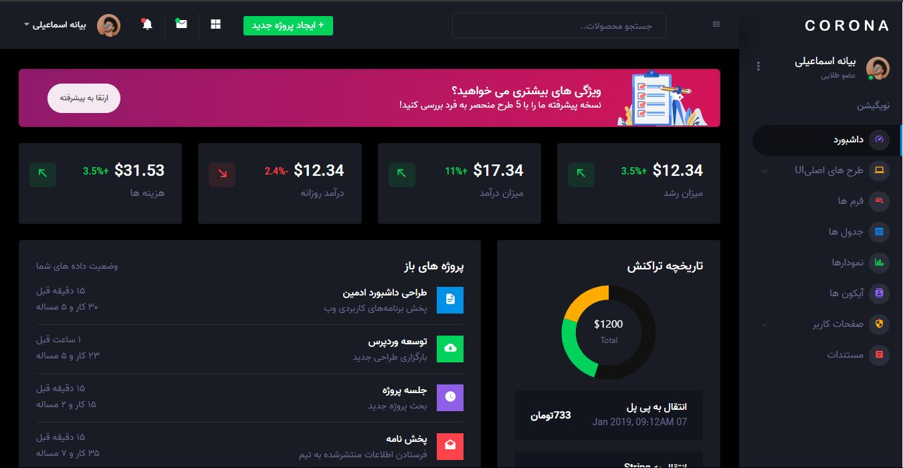

<table>
  <tr>
    <td>
      
    </td>
  </tr>
</table>

<h1 dir="rtl">معرفی</h1>

	Persian Corona Admin یک قالب مدیریت رسپانسیو رایگان است که با Bootstrap 4 ساخته شده است. این قالب دارای طراحی رنگارنگ ، جذاب و در عین حال ساده و ظریف است. قالب به خوبی ساخته شده ، تمام اجزای آن به شکلی دقیق و تمیز طراحی شده اند

Persian Corona Admin دارای تمام ویژگی های متناسب با نیازهای شما است اما با اجزایی که حتی استفاده نمی کنید محدود نیست. این یک ویژگی عالی برای ساخت پنل های مدیریت ، سیستم های تجارت الکترونیکی ، سیستم های مدیریت پروژه ، CMS یا CRM است.

اگرچه این قالب طرحی مانند هیچ طرح دیگری ندارد ، اما به راحتی متناسب با نیازهای شما قابل تنظیم است. Persian Corona Admin دارای یک کد تمیز و کاملاً تفسیر شده است که کار با قالب را آسان می کند. بنابراین آن را به یک گزینه ایده آل برای شروع پروژه تان تبدیل کنید.
قابل ذکر است که این قالب توسط bootstrapdash-team آماده سازی شده و  توسط بیانه اسماعیلی فارسی سازی شده و از این به بعد بر اساس این ورژن توسعه داده میشود.

<h1 dir="rtl">Credits:</h1>
<ul dir="rtl">
  <li>Bootstrap 4</li>
  <li>Material Design Icons</li>
  <li>jQuery</li>
  <li>Gulp</li>
  <li>Chart.js</li>
</ul>

<h1 dir="rtl">پشتیبانی از مرورگرها:</h1>

	Persian Corona Admin برای تمام مرورگرهای اخیر و مدرن به صورت بی نقص طراحی شده‌ است.

<ul dir="rtl">
  <li>Chrome (latest)</li>
  <li>FireFox (latest)</li>
  <li>Safari (latest)</li>
  <li>Opera (latest)</li>
  <li>IE10+</li>
</ul>

<h1 dir="rtl">لایسنس:</h1>

	لایسنس این پروژه متعلق به bootstrapdash-team میباشد . و بدلیل اوپن سورس بودن آن ما توانستیم آن را به شکل فارسی در آورده و در اختیار شما قرار دهیم.

<h1 dir="rtl">چگونه از Persian Corona Admin استفاده کنیم؟</h1>

	1- روی دکمه Clone یا Download در GitHub کلیک کنید و به عنوان یک فایل ZIP بارگیری کنید یا می توانید دستور
 https://github.com/BayanaEsmaeili/Persian-corona-free-dark-bootstrap-admin-template.git را در ترمینال خود وارد کنید تا یک کپی از این قالب را دریافت کنید .

	 2 - پس از دانلود فایل ، شما یک پوشه را با تمام فایل‌های موردنیاز به دست خواهید آورد .

	3 - با اجرای دستور npm install می توانید تمام وابستگی ها را درقالب نصب کنید. تمام فایل های مورد نیاز در node modules وجود دارند.

	4 - فایلی را با نام index.html پیدا کنید ، بررسی کنید تمام اجزای مورد نیاز شما چیست. فایل  را در یک ویرایشگر متن، باز کنید و می توانید ویرایش را شروع کنید.

	5 - اکنون که پروژه شما شروع به کار کرده است ، تمام کاری که اکنون باید انجام دهید کدگذاری ، کدگذاری و کدگذاری بر روی محتوای اصلی شماست.

<h1 dir="rtl">چگونه مشارکت کنیم ؟</h1>

	ما مشارکت شما را دوست داریم و از صمیم قلب از آنها استقبال می کنیم.
برای مشارکت حتماً Node.js و npm را نصب کرده اید. اکنون دستور gulp --version را اجرا کنید. اگر دستور با شماره نسخه Gulp برگردد ، به این معنی است که Gulp را نصب کرده اید. در غیر این صورت برای نصب Gulp باید دستور npm install --global gulp-cli را اجرا کنید.

<h2 dir="rtl">سپس</h2>

 پس از نصب Gulp ، مراحل زیر را برای مشارکت دنبال کنید. 

<ol dir="rtl">
  <li>فورک و شبیه سازی Persian Corona Admin.</li>
  <li>دستور npm install را نصب کنید تا تمام وابستگی ها نصب شود.</li>
  <li>دستور gulp serve را وارد کنید. با این کار Corona Admin در مرورگر پیش فرض شما باز می شود.</li>
  <li>تغییرات خودتان را اعمال کنید</li>
  <li>در نهایت درخواست Pull Request برای ما ارسال کنید</li>
</ol>

